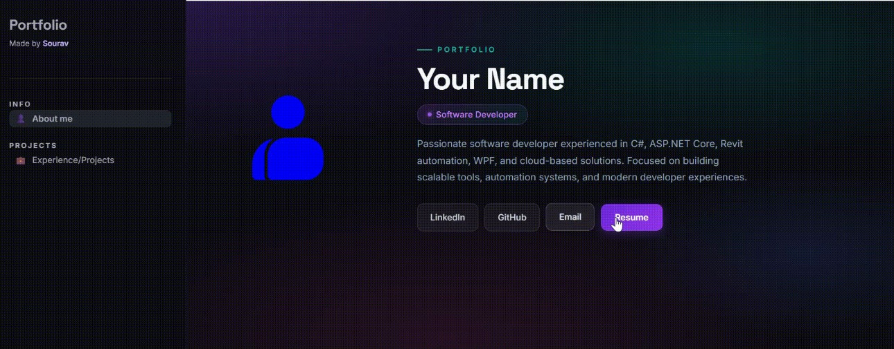
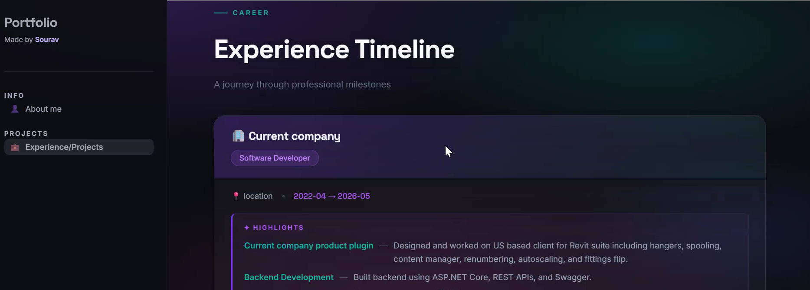

# 🗂️ Portfolio Creator Using Streamlit






A clean, data-driven personal portfolio template built with **Streamlit**. All your personal information — about me, skills, experience, and projects — lives in a single JSON file, so you can update your portfolio without touching any Python code.

---

## ✨ Features

- Multi-page Streamlit app (About Me + Experience/Projects)
- Fully customisable via JSON — no Python knowledge required to update content
- Dev Container support for a one-click, reproducible development environment
- Sidebar navigation with custom branding

---

## 📁 Project Structure

```
Portfolio_Creater_Using_Streamlit/
│
├── .devcontainer/
│   └── devcontainer.json        # Dev Container configuration
│
├── data/
│   ├── myinfo.json              # ⭐ Personal info, skills & social links — edit this
│   ├── experience.json          # ⭐ Work experience & projects — edit this
│   └── resume.pdf               # Your resume — replace with your own PDF
│
├── images/
│   └── bolt.svg                 # Sidebar logo (replace with your own)
│
├── pages/
│   ├── aboutme.py               # "About Me" page — reads from myinfo.json
│   └── maincontent.py           # "Experience / Projects" page — reads from experience.json
│
├── utils/
│   └── ...                      # Shared helper functions
│
├── main.py                      # App entry point — sets up navigation & sidebar
├── requirements.txt             # Python dependencies
└── .gitignore
```

### What each folder does

| Folder / File | Purpose |
|---|---|
| `data/myinfo.json` | Your personal details, skills, and social links. Powers the About Me page. |
| `data/experience.json` | Your work history and projects. Powers the Experience/Projects page. |
| `data/resume.pdf` | Your resume, available for download directly from the portfolio. Replace with your own. |
| `pages/` | One Python file per page. These read the JSON files and render the UI. |
| `images/` | Static assets such as your logo or profile picture. |
| `utils/` | Reusable helper functions shared across pages (e.g. JSON loader). |
| `main.py` | Registers pages and builds the sidebar navigation. |

---

## 🚀 Getting Started (Dev Container — Recommended)

This project ships with a **Dev Container**, giving you a fully configured Python environment inside Docker. No manual dependency installation needed.

### Prerequisites

1. **Docker Desktop** — [Download here](https://www.docker.com/products/docker-desktop/) and make sure it is running.
2. **Visual Studio Code** — [Download here](https://code.visualstudio.com/).
3. **Dev Containers extension** for VS Code — install it from the [VS Code Marketplace](https://marketplace.visualstudio.com/items?itemName=ms-vscode-remote.remote-containers) or run:
   ```
   ext install ms-vscode-remote.remote-containers
   ```

### Steps

1. **Clone the repository**
   ```bash
   git clone https://github.com/souravkh/Portfolio_Creater_Using_Streamlit.git
   cd Portfolio_Creater_Using_Streamlit
   ```

2. **Open in VS Code**
   ```bash
   code .
   ```

3. **Reopen in Dev Container**
   - VS Code will show a notification: *"Folder contains a Dev Container configuration file. Reopen in Container?"*
   - Click **Reopen in Container**.
   - Alternatively, open the Command Palette (`Ctrl+Shift+P` / `Cmd+Shift+P`) and run:
     ```
     Dev Containers: Reopen in Container
     ```
   - Wait for the container to build (first time only — this installs all dependencies from `requirements.txt` automatically).

4. **Run the app**

   Once inside the container, open the integrated terminal and run:
   ```bash
   streamlit run main.py
   ```

5. **Open in browser**

   Streamlit will print a local URL (usually `http://localhost:8501`). Open it in your browser.

---

## 🏃 Running Without Dev Container (Local Setup)

If you prefer not to use Docker:

```bash
# 1. Create and activate a virtual environment
python -m venv .venv
source .venv/bin/activate        # Windows: .venv\Scripts\activate

# 2. Install dependencies
pip install -r requirements.txt

# 3. Run the app
streamlit run main.py
```

---

## ✏️ Personalising Your Portfolio

All content is split across two JSON files in the `data/` folder. You do not need to edit any Python file — just update the JSON and the app reflects your changes instantly.

---

### `data/myinfo.json` — Personal Info & Skills

This file powers the **About Me** page.

```json
{
  "name": "Your Full Name",
  "title": "Your Job Title / Tagline",
  "email": "you@example.com",
  "linkedin": "https://linkedin.com/in/yourprofile",
  "github": "https://github.com/yourusername",
  "summary": "A short bio or introduction about yourself.",
}
```

| Field | Description |
|---|---|
| `name` | Your full name, displayed as the page heading. |
| `title` | Your role or tagline shown under your name. |
| `email` | Contact email address. |
| `linkedin` | Full URL to your LinkedIn profile. |
| `github` | Full URL to your GitHub profile. |
| `summary` | A paragraph about you — keep it concise. |
| `skills` | A list of skills rendered as tags or a list on the About Me page. Add or remove as needed. |

---

### `data/experience.json` — Work Experience & Projects

This file powers the **Experience / Projects** page.

```json
{
  "experience": [
    {
      "company": "Company Name",
      "role": "Your Role",
      "duration": "Jan 2022 – Present",
      "description": "What you did and what you achieved in this role."
    }
  ],
  "projects": [
    {
      "title": "Project Title",
      "description": "What the project does and what technologies you used.",
      "link": "https://github.com/yourusername/project-repo"
    }
  ]
}
```

| Field | Description |
|---|---|
| `experience[].company` | Employer name. |
| `experience[].role` | Your job title at that company. |
| `experience[].duration` | Date range, e.g. `"Jun 2020 – Dec 2021"`. |
| `experience[].description` | What you worked on; use bullet-style text or a short paragraph. |
| `projects[].title` | Project name shown as the card heading. |
| `projects[].description` | Brief description of what the project does. |
| `projects[].link` | URL to the live app or source code (optional). |

To **add** a new job or project, copy an existing object in the array and fill in your details. To **remove** one, delete its `{ }` block. The order in the file is the order shown on screen.

---

### `data/resume.pdf` — Resume Download

Replace this file with your own PDF, keeping the filename `resume.pdf`. The app links to it directly for visitors to download. If you rename the file, update the reference in `pages/aboutme.py`.

---

## 🖼️ Replacing the Logo

Swap out `images/bolt.svg` with your own SVG or PNG file, then update the path in `main.py`:

```python
st.logo("images/your_logo.svg")
```


---

## 🤝 Contributing

Contributions are welcome! Feel free to open an issue or submit a pull request for bug fixes, new features, or improvements to the template.

---

## 📄 License

This project is open source. See the repository for license details.

Leave a ⭐ if this repo helped you!
